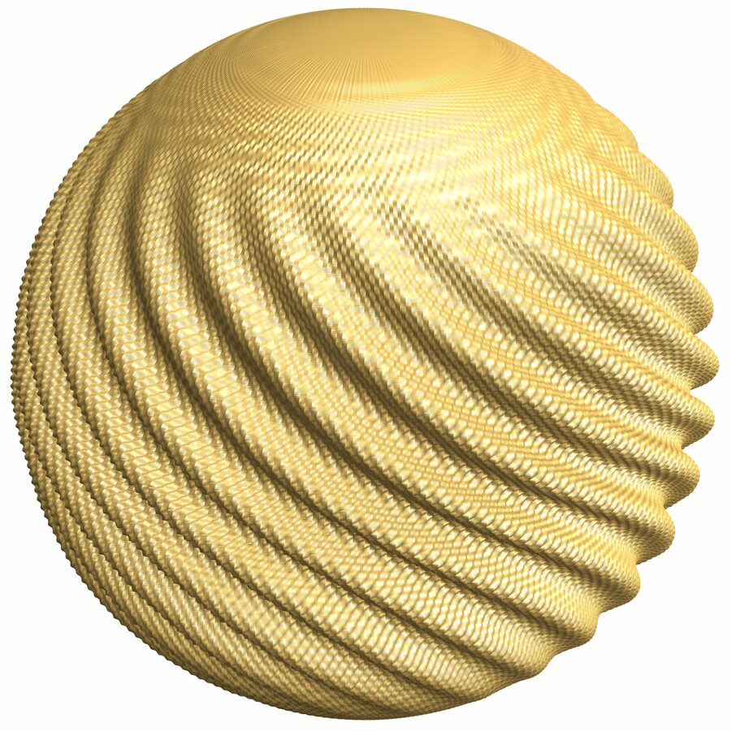

# Hévéa reduced sphere: C++ + Wolfram Language reproduction



这是一个可复现的 C++ / Wolfram Language（MMA）数值实现：按照 Bartzos、
Borrelli、Denis、Lazarus、Rohmer 与 Thibert 在 2017 年论文中给出的特征流凸积分
框架，将单位球面的短嵌入依次施加三次 corrugation，并生成接近论文 Figure 9 的
`f_{1,3}` 有限阶段网格与可视化。上图由本仓库 v5 实现生成，不是论文截图。

## 数学边界

- 本仓库生成的是三次 corrugation 后的有限网格，即 `f_{1,3}` 的数值近似。
- 严格的 `C^1` 等距嵌入是无限迭代极限 `f_∞`；任何有限网格都不能等同于该极限。
- 论文没有公开初始 profile 与过渡函数的全部数值参数。本实现用作者公开 WRL
  网格的轴对称平均和 mode-21 纬向包络约束十参数十三次 Hermite profile，属于
  通过论文数值带认证的复现，而不是作者未公开参数的逐位恢复。
- 当前认证的目标包围球半径为 `0.52`。

## Hévéa 来源与致谢

本项目明确引用并改写了 [@HeveaProject/Hevea](https://github.com/HeveaProject/Hevea)
平坦环面程序中的思想和代码结构，特别是单维 corrugation、Bessel 函数反演、
数值积分与网格输出机制。感谢 `@HeveaProject`，以及其 README 署名的原始代码
作者 Vincent Borrelli、Saïd Jabrane、Francis Lazarus 和 Boris Thibert。

Hévéa 上游公开的是平坦环面实现；本仓库的球面 profile、特征流、三方向调度、
数值证书、CMake/LibraryLink 接口和 MMA wrapper 是针对 reduced sphere 的独立实现。
详细归属见 [NOTICE](NOTICE)。由于包含/改写 GPLv3 上游代码，本仓库源码采用
[GNU GPL version 3](LICENSE)。

## 论文

实现依据：Bartzos et al., *An Explicit Isometric Reduction of the Unit Sphere into
an Arbitrarily Small Ball*, Foundations of Computational Mathematics (2017),
[DOI 10.1007/s10208-017-9360-1](https://doi.org/10.1007/s10208-017-9360-1)。

复现时使用的 PDF 已收录在
[paper/An-Explicit-Isometric-Reduction-of-the-Unit-Sphere-2017.pdf](paper/An-Explicit-Isometric-Reduction-of-the-Unit-Sphere-2017.pdf)，
其 SHA-256 为 `8bb5a075c4247c72214e57aad20bf87894d377deb680d1bb5c2ef036f4b921b6`。
论文 PDF 不属于本仓库 GPL 源码许可证，版权与再分发权仍归论文作者及出版方。

## 环境与构建

当前 native wrapper 使用 Linux 的 `fork` / `dladdr`，已在 Linux + C++17 +
Wolfram Mathematica 环境验证。需要 CMake 3.16+、支持 C++17 的编译器、Wolfram
LibraryLink headers；OpenMP 可选但强烈建议启用。

```bash
git clone https://github.com/Juddd/hevea-reduced-sphere.git
cd hevea-reduced-sphere
cmake -S . -B build -DCMAKE_BUILD_TYPE=Release
cmake --build build -j 4
ctest --test-dir build --output-on-failure
```

CMake 会在仓库根目录生成 `hevea_reduced_sphere` 与
`libheveaReducedSphere_mma_static.so`。MMA wrapper 会相对自身定位 `.so`，native
LibraryLink 层再相对 `.so` 定位可执行文件，因此没有原作者机器或本项目开发机的
绝对路径依赖。也可分别用环境变量 `HEVEA_REDUCED_SPHERE_LIBRARY` 与
`HEVEA_REDUCED_SPHERE_EXECUTABLE` 覆盖路径。

## MMA 调用

```wl
repo = "/absolute/path/to/hevea-reduced-sphere";
Get[FileNameJoin[{repo, "wolfram", "CPHeveaReducedSphere.wl"}]];

result = MyFun`CPHeveaReducedSphere[
  "OutputDirectory" -> FileNameJoin[{repo, "artifacts", "sphere"}],
  "TimeLimit" -> 3600];

{result["ProcessSucceeded"], result["NumericallyValid"], result["Succeeded"]}
result["MetricReports"]
finalFile = SelectFirst[result["Files"],
  StringContainsQ[#, "sampled_reduced_sphere"] && StringContainsQ[#, "stage=3"] &];
Show[Import[finalFile], BoxRatios -> Automatic, SphericalRegion -> True,
  Boxed -> False, Axes -> False, PlotRange -> All, ImageSize -> 700]
```

默认参数正是 v5 认证配置：`4000×20000`、`{21,142,997}`、`BallRadius=0.52`、
`Eta=0.5`、`TargetMetricFraction=0.237`。默认 `OutputMode -> "Preview"` 仍需完成
全分辨率计算，但只写四个降采样全局 VTK，避免额外写出约 30 GiB ASCII 网格。

## 一条命令复现 README 视图

完成 Release 构建后执行：

```bash
wolframscript -file wolfram/ReproduceVisualization.wls /absolute/output/directory
```

脚本使用上述认证参数运行 C++、检查 `Succeeded`、导入最终 sampled VTK，并用与
README 图一致的固定相机、材质和光照导出 `reduced-sphere-v5.png`。这是高分辨率
计算，不是轻量 smoke test；运行时间与内存取决于 CPU、OpenMP 线程数和机器内存。

只验证 C++/LibraryLink/MMA 调用链时，可运行：

```bash
wolframscript -file hevea_reduced_sphere.wlt
```

## 返回值与输出

- `ProcessSucceeded`：native 子进程是否正常退出。
- `NumericallyValid`：primitive coordinate、flow Jacobian、包围半径以及认证配置的
  metric bands 是否通过。
- `Succeeded`：上述条件通过且当前 UUID run 的原子 manifest 写出成功。
- `Files`：只列出当前 run 生成的 VTK，不会混入输出父目录中的旧文件。
- `OutputMode -> "Full"`：额外写出完整阶段 VTK；请先准备足够磁盘空间。

## 源码结构

- `hevea_reduced_sphere.cpp`：球面三阶段 corrugation 主程序。
- `src/`：profile 与 Hévéa 风格数值核。
- `hevea_reduced_sphere_wolfram.cpp`：Linux LibraryLink native wrapper。
- `wolfram/CPHeveaReducedSphere.wl`：完整、独立的 MMA API。
- `wolfram/ReproduceVisualization.wls`：从计算到 PNG 的可复现入口。
- `tools/`：profile 搜索、metric、mesh、ridge 与 envelope 审计工具。
- `tests/`：C++、MMA、sanitizer、paper-grid 与可视化验收脚本。
- `docs/`：论文公式映射、profile 证书与源码审计。
- `paper/`：实现所依据论文的本地参考副本与版权说明。

## License

源代码依 GNU GPL v3 发布。论文 PDF 与论文内容不适用该源码许可证；详见
`paper/README.md`。
